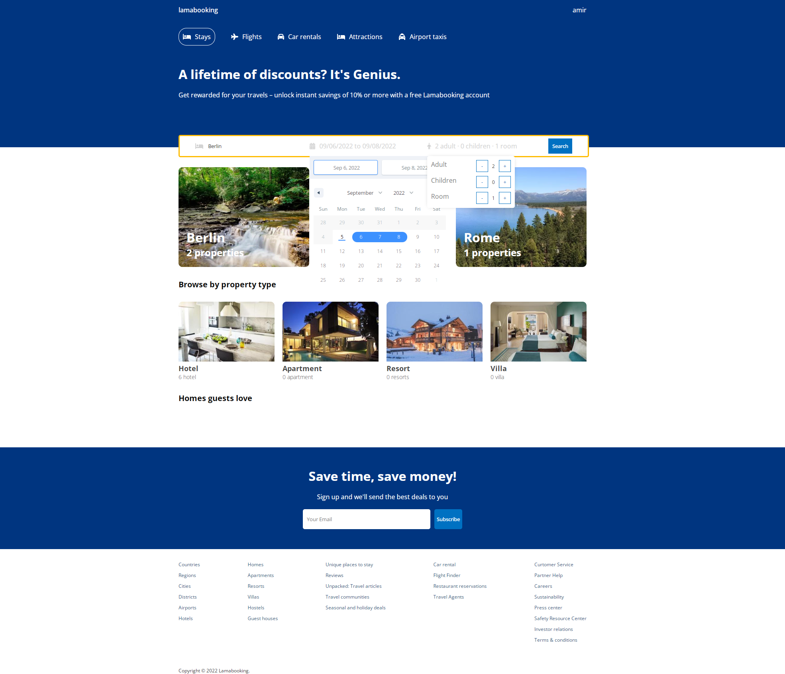

## About TWS

TWS is a web application to make a travelling reservation website by Node.js and react. TWS has used these packages inside of it. 

- Express [Fast, unopinionated, minimalist web framework for Node.js](https://expressjs.com/).
- Database  [MongoDB](https://www.mongodb.com/).
- And etc...

TWS uses Node.js at the back-end and React at the front-side. Mobile application come up with React.js. This application it's been developing and each part will be uploaded as soon as possible.

## Install

### Install dependencies and run the backend
You just need to download the package, And then you have to use "npm install" command to install all necessary packages. Then you just need to open api directory by using [npm start](). Now Node.js server is ready, and you can see 'Server running at port 8000'.

###### To install the dependencies and start the app, run the following commands:
* >cd api
* >npm install
* >npm start

### Install dependencies and run the frontend

Now you need to run react to see the front-side. To do this, You need to open client directory, Then "run npm" install and then "npm start" command to see the React output on your browser.

###### To install the dependencies and start the app on the frontend, run the following commands:
* >cd client
* >npm install
* >npm start

## Help 

Please post any questions as an email to [Amir haghighi](mailto:haghighi251@gmail.com).

## TWS Sponsors

 If you are interested in becoming a sponsor, please send an email me. haghighi251@gmail.com

## Contributing

Thank you for considering contributing to the TWS ! please send an email me. haghighi251@gmail.com.

## Security Vulnerabilities

If you discover a security vulnerability within TWS, please send an e-mail to Amir haghighi via haghighi251@gmail.com.
 All security vulnerabilities will be promptly addressed.

## License

The TWS framework is open-sourced software licensed under the MIT license. You can see more info at hte link below:
https://opensource.org/licenses/MIT
